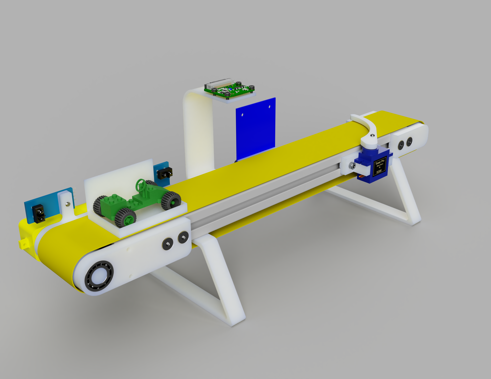
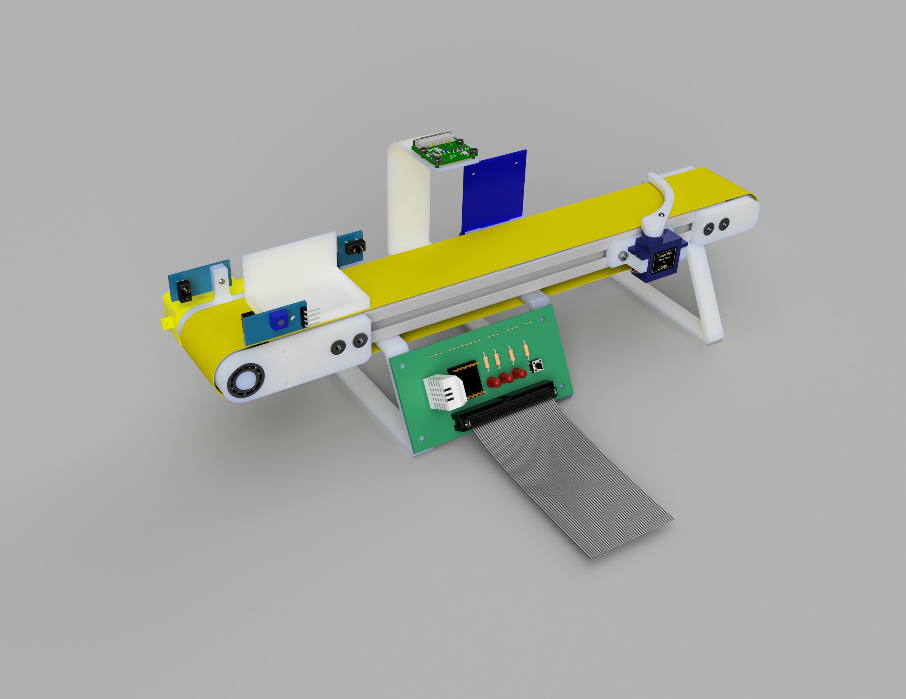
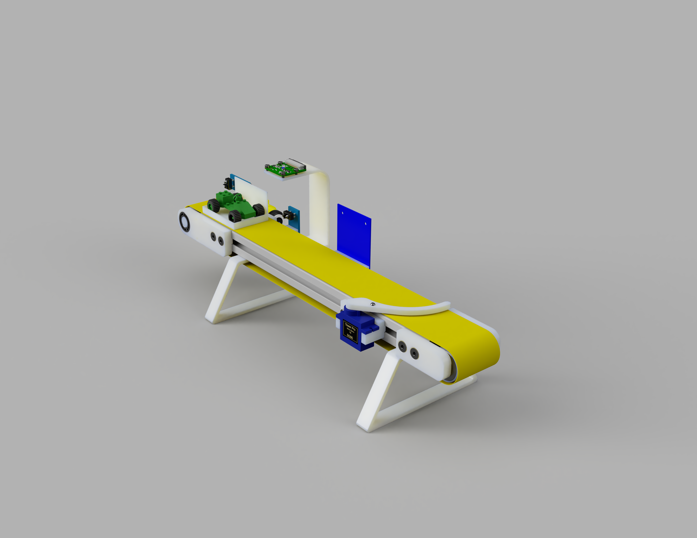
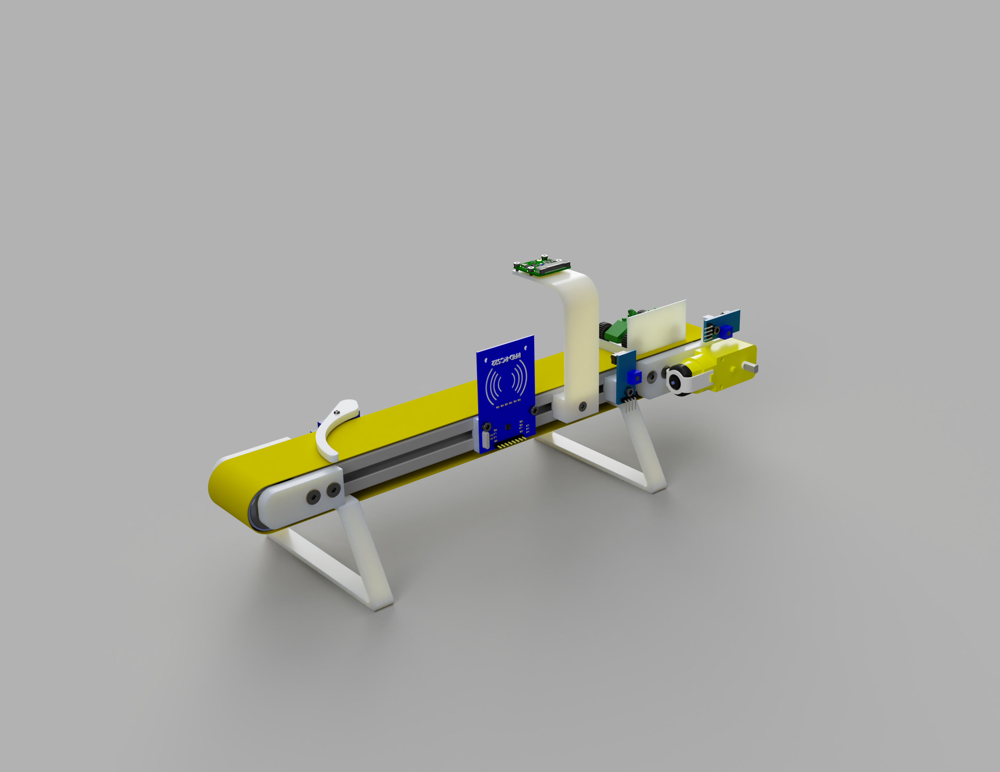

# Miniature Conveyor Belt 

Miniature conveyor belt for simulation and fun working with sensors, all controllable with Raspberry Pi. All sensors and actuators of the conveyor belt are connected to the GPIO pins of the Raspberry Pi via a separate circuit board. The board contains a motor driver, a push button and three LEDs.

As simulation software [Node-RED](https://nodered.org/) could be used locally on the Raspberry Pi. Based on this, the sensors and actuators could also be mapped as device shadows in the AWS IoT platform (Software follows :smile:).

## Components

The following components were used and can be screwed directly to the 3D-printed parts.

### Hardware

| No. | Name                                        | Quantity  | Notes             |
| :-: | :------------------------------------------ | :-------: | :---------------- |
| 1   | RFID reader RC522                           | 1         |                   |
| 2   | IR photoelectric switch barrier TRCT5000    | 1-3       |                   |
| 3   | Servo motor SG90                            | 1         |                   |
| 4   | Motor driver DRV8833                        | 1         |                   |
| 5   | TT motor DC3V-6V                            | 1         |                   |
| 6   | Raspberry Pi Camera Module                  | 1         |                   |
| 7   | Raspberry Pi 3/4                            | 1         |                   |
| 8   | Ball bearing 608 2RS 8x22x7 mm              | 2         | deflection roll   |
| 9   | Ball bearing 6800 zz 10x19x5                | 2         | drive roll        |
| 10  | Aluminium profile 20mm x 40mm x 290mm       | 1         |                   |
| 11  | Elastic band                                | 1         |                   |
| 12  | LEDs                                        | 3         |                   |
| 13  | Resistors for LEDs                          | 3         |                   |
| 14  | Push button                                 | 3         | see PCB           |

### Screws

| No. | Name                        | Quantity  | Notes             |
| :-: | :-------------------------- | :-------: | :---------------- |
| 1   | M3 x 8 countersunk screw    | 4         |                   |
| 2   | M3 x 10 countersunk screw   | 3         |                   |
| 3   | M3 x 12 countersunk screw   | 6         |                   |
| 4   | M4 x 10 countersunk screw   | 24        |                   |
| 5   | M4 x 12 countersunk screw   | 24        |                   |
| 6   | M3 x 5 flat headed screw    | 6         |                   |
| 7   | M3 x 10 flat headed screw   | 6         |                   |
| 8   | M3 x 12 flat headed screw   | 6         |                   |
| 9   | M3 x 18 flat headed screw   | 13        |                   |
| 10  | M3 x 25 flat headed screw   | 6         |                   |
| 11  | M2 spacer                   | 6         |                   |

### 3D printed parts

| No. | Name                            | Quantity  | Notes                             |
| :-: | :------------------------------ | :-------: | :-------------------------------- |
| 1   | box                             | 1         |                                   |
| 2   | camera mount                    | 1         |                                   |
| 3   | deflection roll                 | 1         |                                   |
| 4   | deflection roll mount           | 1         |                                   |
| 5   | deflection roll mount mirrored  | 1         |                                   |
| 6   | drive roll                      | 1         |                                   |
| 7   | foot                            | 2         |                                   |
| 8   | IR sensor mount                 | 1-2       | one servo is mounted on the motor |
| 9   | motor mount                     | 1         |                                   |
| 10  | motor mount mirrored            | 1         |                                   |
| 11  | servo lever                     | 1         |                                   |
| 12  | servo mount                     | 1         |                                   |
